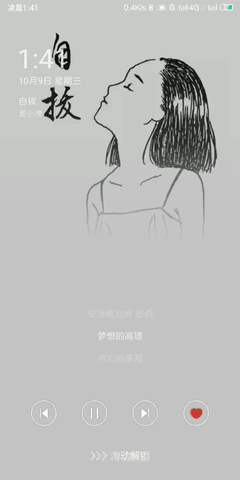
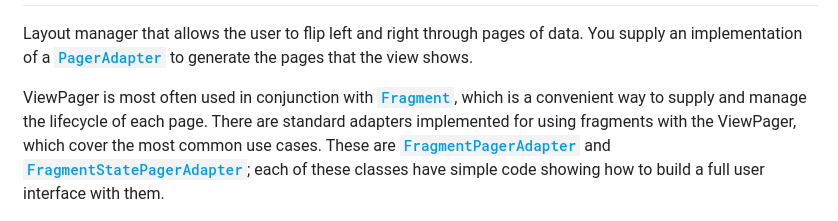
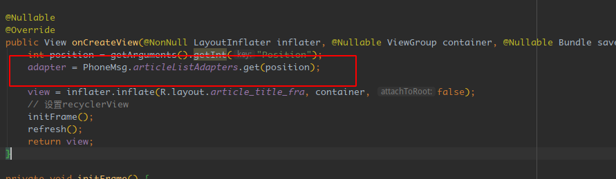

## 安卓TabLayout，ViewPager以及fragment的使用

### Demo效果

首先先说一下这个demo的最终效果吧：



我们的安卓作业需要我们结合RecyclerView，TabLayout，PaperView以及fragment做一个简单的Demo，于是便有了这样的一个demo，其中页面中的数据来自于[**玩安卓**](https://www.wanandroid.com/blog/show/2)的开放API，使用的是其中的公众号接口。

- tabLayout ：在图中表示的上面的能够进行滑动的tab。

- fragment：

  fragment 简单点来说就是一个模块，类似activity，在里面可以放一些其他的组件（比如说textView等等），并且有着自己的生命周期。但是它**必须**放在activity中间，具体的一些信息，可以去看一看官方文档[中文](https://developer.android.com/guide/components/fragments?hl=zh-cn)，[英文](https://developer.android.com/guide/components/fragments.html)（推荐看英文的，感觉中文的就是机翻，怪怪的）

- viewPaper：

  这个是一段来自官网的介绍

  

  ViewPaper就是简单的页面切换组件，我们往里面填充View，然后就可以使用左滑和右滑来进行View的切换。和RecycleView（或者ListView）很类似，我们都需要使用Adapter（PagerAdapter）来填充数据。google官方文档中，推荐我们使用Fragment来填充ViewPager。

因此简单点说，就是TabLayout和ViewPager相关联，然后通过滑动ViewPager实现Fragment的切换，然后在Fragment中使用RecycleView来显示数据。


### 主要代码分析

```xml
<?xml version="1.0" encoding="utf-8"?>
<LinearLayout
    xmlns:android="http://schemas.android.com/apk/res/android"
    xmlns:tools="http://schemas.android.com/tools"
    android:layout_width="match_parent"
    android:layout_height="match_parent"
    tools:context=".MainActivity"
    android:orientation="vertical">

    <com.google.android.material.tabs.TabLayout
        android:id="@+id/tablayout"
        android:layout_width="match_parent"
        android:layout_height="wrap_content"
        xmlns:app="http://schemas.android.com/apk/res-auto"
        app:tabMode="scrollable"
        xmlns:android="http://schemas.android.com/apk/res/android" />

    <androidx.viewpager.widget.ViewPager
        android:layout_width="match_parent"
        android:layout_height="match_parent"
        android:id="@+id/article_title_view_pager" />

</LinearLayout>
```

MainActivity的代码

```java
public class MainActivity extends AppCompatActivity {
    private TabLayout tabLayout;
    private ViewPager viewPager;

    @Override
    protected void onCreate(Bundle savedInstanceState) {
        super.onCreate(savedInstanceState);
        setContentView(R.layout.activity_main);
        viewPager = findViewById(R.id.article_title_view_pager);
        init();
    }

    private void init() {
        // 下面的这个代表目前是横屏还是竖屏，不需要理会
        if (findViewById(R.id.land_content) != null) {
            PhoneMsg.isTwoPane = true;
        } else {
            PhoneMsg.isTwoPane = false;
        }
        initTab();
    }

    public void initTab() {
        try {
            // 下面的代表获取数据，我们只需要知道PhoneMsg.wxAuthorList保存了文章的信息即可
            AsyncTask<ProcessInterface, Integer, Object> asyncTask = new AsyncRequest().execute(new GetWxAuthorList());
            PhoneMsg.wxAuthorList = (WxAuthorList) asyncTask.get();

            tabLayout = findViewById(R.id.tablayout);

            // 创建Tab页
            for (int i = 0; i < PhoneMsg.wxAuthorList.getData().size(); i++) {
                tabLayout.addTab(tabLayout.newTab());
            }
            // ArticleTitlePageAdapter表示的就是ViewPager的适配器（后面会说明），其中我们需要传过去的参数是，getSupportFragmentManager()：为了拿到Fragment的控制器, tabLayout.getTabCount()，获得view的个数
            ArticleTitlePageAdapter adapter = new ArticleTitlePageAdapter(getSupportFragmentManager(), tabLayout.getTabCount());

            viewPager.setAdapter(adapter);
            // 这一步是为了将tabLayout与viewpaper同步，值得注意的点是：如果将这一步放在tablayOut的setText后面，则会导致tab的名字空白
            tabLayout.setupWithViewPager(viewPager);
            // 创建Tab页
            for (int i = 0; i < PhoneMsg.wxAuthorList.getData().size(); i++) {
                String name = PhoneMsg.wxAuthorList.getData().get(i).getName();
                int id =  PhoneMsg.wxAuthorList.getData().get(i).getId();
                tabLayout.getTabAt(i).setText(name);

                // ArticleListAdapter代表的是RecycleView的适配器，我们将这个Adapter保存起来（为什么要这样做我后面说）
                PhoneMsg.articleListAdapters.add(i,new ArticleListAdapter(MainActivity.this,id));
            }
            // 添加选择事件
            tabLayout.addOnTabSelectedListener(new TabClick(this));
        } catch (ExecutionException e) {
            e.printStackTrace();
        } catch (InterruptedException e) {
            e.printStackTrace();
        }
    }


    class TabClick implements TabLayout.OnTabSelectedListener {
        Context context;

        public TabClick(Context context) {
            this.context = context;
        }
        @Override
        public void onTabSelected(TabLayout.Tab tab) {
            // 将viewPaper的位置改变
            viewPager.setCurrentItem(tab.getPosition());
        }

        @Override
        public void onTabUnselected(TabLayout.Tab tab) {

        }

        @Override
        public void onTabReselected(TabLayout.Tab tab) {

        }
    }
}

```

### ViewPager的适配器

 这个适配器的功能很简单，就是为了返回Fragment去填充ViewPager。可以看到下面的代码，就是根据不同position来产生不同的Fragment。

```java
public class ArticleTitlePageAdapter extends FragmentStatePagerAdapter {

    private int num;
    private HashMap<Integer,ArticleTitleFra> map;

    public ArticleTitlePageAdapter(@NonNull FragmentManager fm, int num) {
        super(fm, num);
        this.num = num;
        map = new HashMap(num);
    }

    /**
     * 返回对应位置的Fragment
     * @param position 代表目前滑动所处的位置
     * @return
     */
    @NonNull
    @Override
    public Fragment getItem(int position) {
        if (map.containsKey(position)){
            return map.get(position);
        }
        return createFragment(position);
    }

    /**
     * 创建一个frame
     * @param position
     * @return
     */
    private Fragment createFragment(int position) {
        // ArticleTitleFra.newInstance(position)会返回一个Fragment
        map.put(position, ArticleTitleFra.newInstance(position));
        return map.get(position);
    }

    @Override
    public int getCount() {
        return num;
    }
}
```

下面就是关于Fragment的适配器，其中在Fragment中是一个RecycleView。

### Fragment的适配器

```java
public class ArticleTitleFra extends Fragment {

    private View view;
    private RecyclerView recyclerView;
    private ArticleListAdapter adapter;


    public static ArticleTitleFra newInstance(int position) {
        Bundle bundle = new Bundle();
        bundle.putInt("Position", position);
        ArticleTitleFra articleTitleFra = new ArticleTitleFra();
        articleTitleFra.setArguments(bundle);
        return articleTitleFra;
    }

    @Nullable
    @Override
    public View onCreateView(@NonNull LayoutInflater inflater, @Nullable ViewGroup container, @Nullable Bundle savedInstanceState) {
        int position = getArguments().getInt("Position");
        // PhoneMsg.articleListAdapters里面保存了RecycleView的适配器
        adapter = PhoneMsg.articleListAdapters.get(position);
		// article_title_fra表示的就是Fragment 的xml文件
        view = inflater.inflate(R.layout.article_title_fra, container, false);
        // 设置recyclerView
        initFrame();
        // refresh()目的是为了设置recycleView的Adapter
        refresh();
        return view;
    }

    private void initFrame() {
        recyclerView = view.findViewById(R.id.article_list);
        recyclerView.setLayoutManager(new LinearLayoutManager(view.getContext()));
        // 设置 ItemAnimator动画
        recyclerView.setItemAnimator(new DefaultItemAnimator());
    }

    /**
     * 刷新数据
     *
     * @param
     */
    public void refresh() {
        recyclerView.setAdapter(this.adapter);
    }
}

```

RecycleView的适配器我就不展示code了。在这里个里面我们有一个值得注意的点，在Fragment中，我们是使用了一个newInstance来示例化一个对象，并且将position保存在Bundle中，为什么我们这样做呢？假设我们不这样做，那么在横竖屏切换的时候会产生一个问题。就是在竖屏切换到横屏的时候，recycleView的数据会消失。（值得注意点的是：在MainActivity中onCreate方法会再次执行一遍）。按照道理来说，不应该出现这种情况的，那么为什么会出现这种情况呢？初略的浏览了一下源代码，我觉的可能是这样的：

> FragmentStatePagerAdapter中会将Fragment进行序列化，在加载新的页面的时候，它会看以前有没有进行加载，如果加载了，则从序列化的数据中将Fragment拿出来。我们可以用Log进行日志输出，然后会发现，在横竖屏转动的时候，这一个日志并不会进行打印。
>
> 那么，为什么我们使用newInstance来实例化对象而不是通过构造方法来示例化对象呢？很可惜，不行，因为在Fragment中，会通过反射调用Fragment的无参构造函数来获得Fragment的实例。所以如果我们在Fragment中只写了有参构造器而没有写无参构造器，那么程序则会报` java.lang.RuntimeException: Unable to start activity ComponentInfo{cc.weno.android_news/cc.weno.android_news.MainActivity}: androidx.fragment.app.Fragment$InstantiationException: Unable to instantiate fragment cc.weno.android_news.fragment.ArticleTitleFra: could not find Fragment constructor`的错误。
>
> 而在Fragment序列化的过程中，会将Bundle进行序列化，而在反序列化中，又会将boundlei进行反序列化，so，我们就可以在创建实例化的过程中将同时设置Bundle，因此下面的情况也是ok的。
>
> ```java
> public ArticleTitleFra(){
>
> }
>
> public ArticleTitleFra(int position){
>     Bundle bundle = new Bundle();
>     bundle.putInt("Position", position);
>     setArguments(bundle);
> }
> ```

这也就解释了为什么我使用`PhoneMsg.articleListAdapters`来保存recycleView的适配器了，因为在Fragment createView的时候，我们根据position的位置来获得对应的适配器。那么我们将recycleview的适配器添加到Bundle中呢？当然没有问题，不过我们就需要对recycleview的适配器进行序列化了。




 总的来说这个作业还是比较简单的，只不过在这个序列化的这个地方被坑了好久，查问题感觉自己的头发都掉了好多。